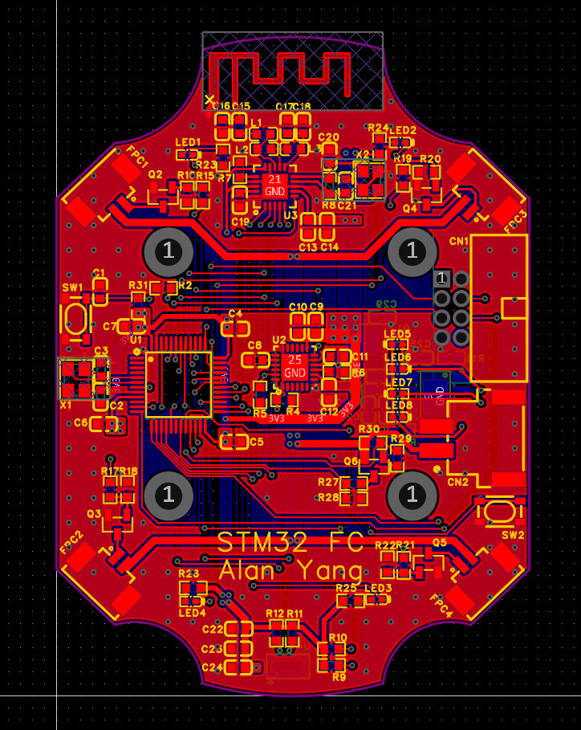
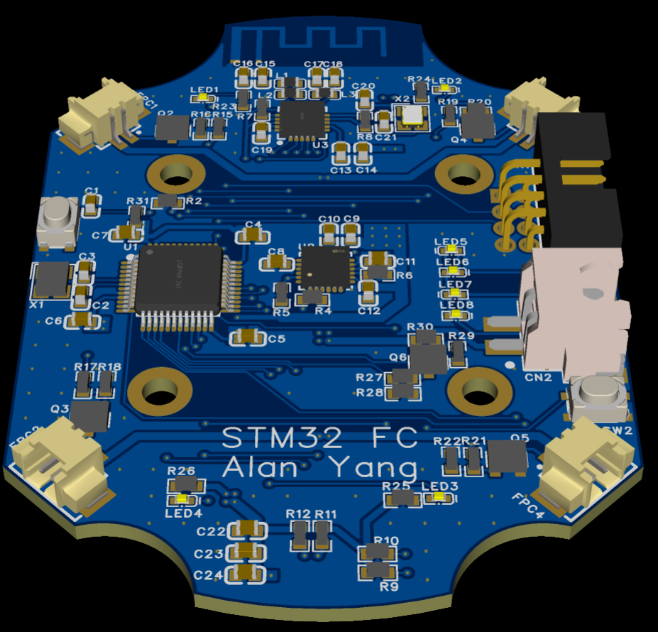
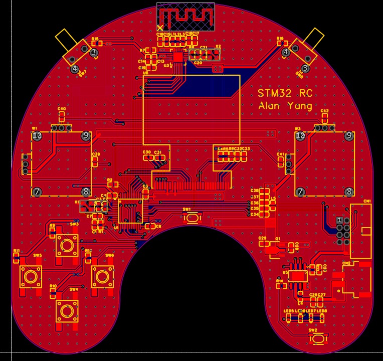
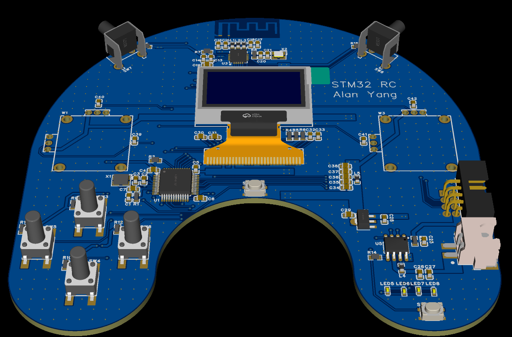
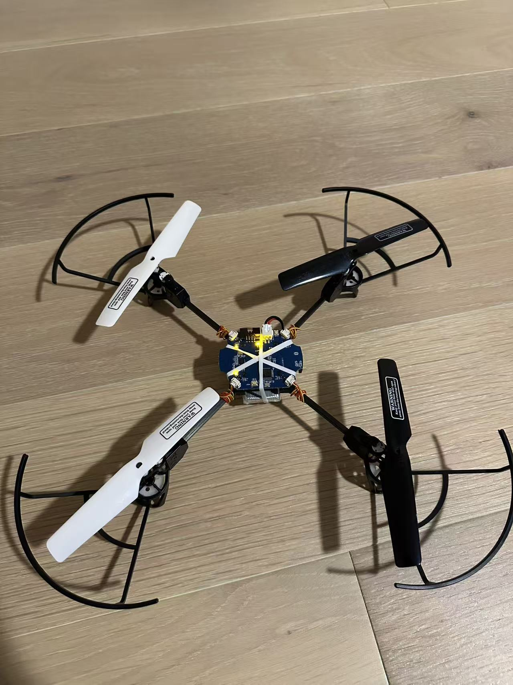
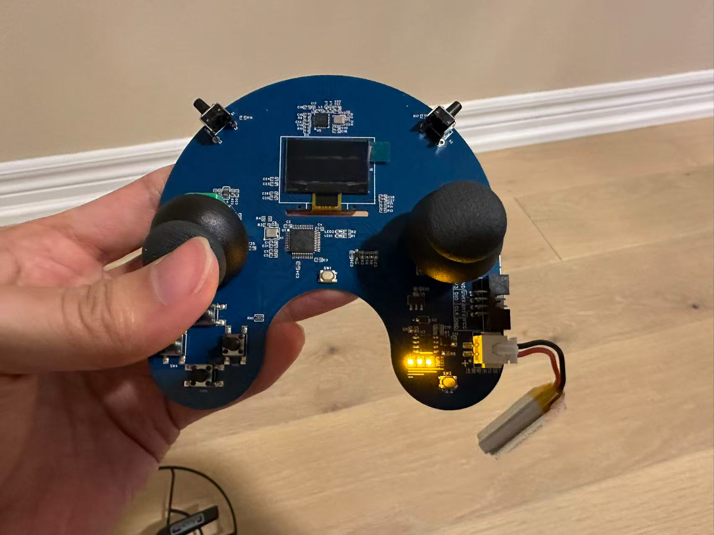
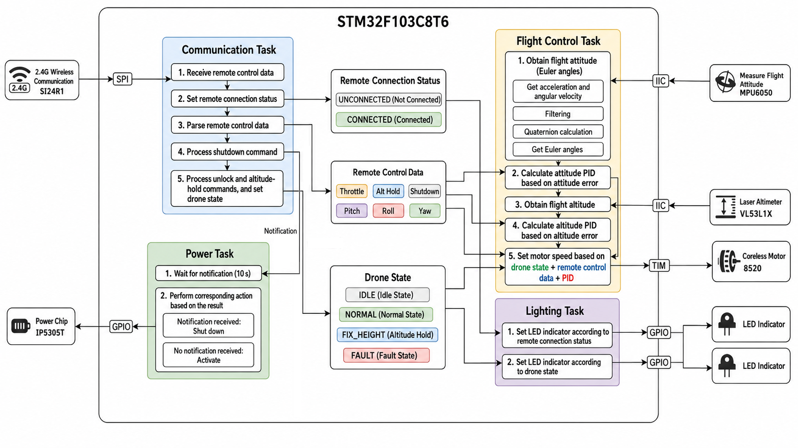
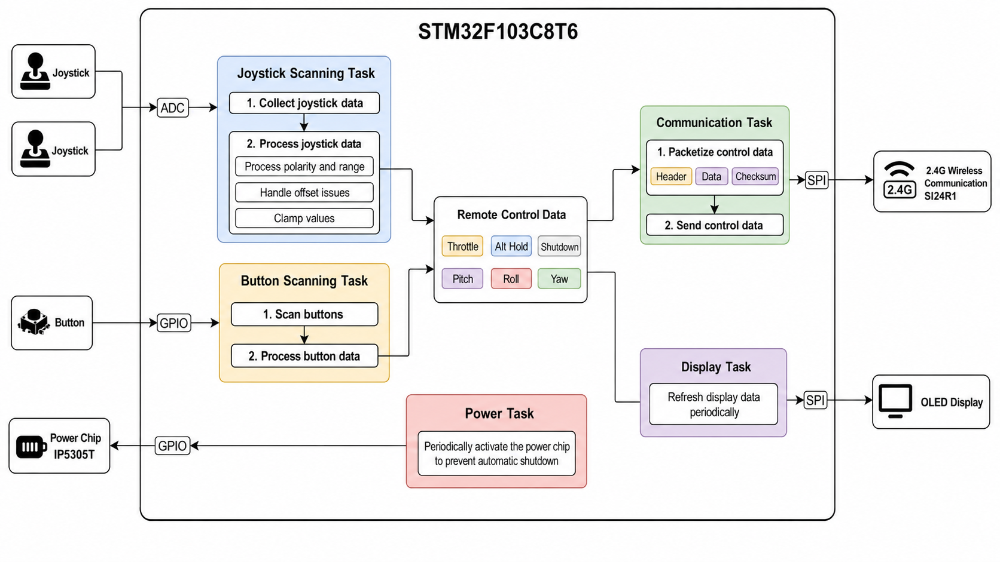

# STM32 Quadcopter

A custom **STM32F103C8T6** + **FreeRTOS** quadcopter system with separate flight-controller (FC) and radio-controller (RC) boards.

The project focuses on real-time embedded firmware, attitude estimation, closed-loop flight control, wireless communication, and flight-safety logic.

## Features 

- FreeRTOS multi-task firmware architecture
- MPU6050 IMU acquisition and filtering
- Quaternion-based attitude estimation
- Cascaded angle–angular velocity PID control
- Altitude sensing and altitude-hold mode
- Si24R1 2.4 GHz wireless communication
- PWM control for four coreless motors
- Flight-state management and Safe-Unlock logic
- Connection-loss detection and failsafe motor ramp-down
- OLED and LED status feedback
- Power-management logic

--- 

## System Architecture

### Flight Controller

- **MCU:** STM32F103C8T6 + FreeRTOS
- **IMU:** MPU6050 over I²C
- **Altitude Sensor:** VL53L1X ToF sensor over I²C
- **Motors:** 4× 8520 coreless motors with timer/PWM control
- **Wireless:** Si24R1 2.4 GHz transceiver over SPI
- **Power:** Battery power management with IP5305T
- **Indicators:** GPIO-controlled status LEDs
- **Debug:** SWD interface

### Radio Controller

- **MCU:** STM32F103C8T6 + FreeRTOS
- **Input:** Dual analog joysticks through ADC
- **Controls:** GPIO push buttons
- **Display:** OLED display
- **Wireless:** Si24R1 2.4 GHz transceiver over SPI
- **Power:** IP5305T power management

---

## Hardware Design

Both controller boards were designed and routed in **EasyEDA**, with consideration for:

- Ground planes and low-noise signal return paths
- Separation of motor power and sensitive digital/sensor signals
- Short SPI and I²C routing
- High-current motor routing
- Local decoupling and power regulation
- Peripheral and timer-aware STM32 pin assignment
- Mechanical clearance and component placement

### Flight Controller PCB

The FC integrates the STM32, IMU, range sensor, RF module, motor drivers, power circuitry, and debug interfaces onto a compact PCB.

  

    
    
FC Layout

  

  

    
    
FC 3D Visualization

  

### Radio Controller PCB

The RC integrates dual joysticks, control buttons, OLED feedback, RF communication, and portable power management into a handheld controller.

  

    
    
RC Layout

  

  

    
    
RC 3D Visualization

  

### Assembled PCBs

  

    
    
FC PCB

  

  

    
    
RC PCB

  

---

## Firmware Development

The firmware is built on **FreeRTOS** with a layered architecture separating application, control algorithm, and hardware driver logic.

### Key Features

- FreeRTOS multi-task architecture
- Quaternion-based attitude estimation with sensor filtering
- Cascaded angle–angular velocity PID flight control
- Altitude-hold control using VL53L1X
- Custom Si24R1 2.4 GHz communication protocol
- Safe-Unlock, flight state machine, and Failsafe protection

### Flight Controller (FC)

- Reads and filters MPU6050 IMU data for real-time attitude estimation
- Runs cascaded PID control and mixes outputs across four motors
- Supports altitude hold and `IDLE`, `NORMAL`, `FIX_HEIGHT`, and `FAULT` states
- Handles wireless loss, Failsafe, Safe-Unlock, and shutdown behavior

### Radio Controller (RC)

- Samples and calibrates dual analog joysticks through ADC
- Generates throttle, pitch, roll, yaw, altitude-hold, and system commands
- Packages and transmits validated control packets over Si24R1
- Manages OLED feedback, buttons, connection status, and power

---

## Skills Demonstrated

- STM32 embedded C & FreeRTOS development
- Schematic design & PCB layout
- SPI, I²C, ADC, GPIO & PWM
- IMU filtering & quaternion attitude estimation
- Cascaded PID flight control
- Embedded state machines & Failsafe design
- Custom 2.4 GHz wireless communication
- Hardware/firmware system integration

This project demonstrates the complete embedded systems workflow: from PCB design and hardware integration to real-time firmware, wireless communication, sensor processing, and closed-loop flight control.